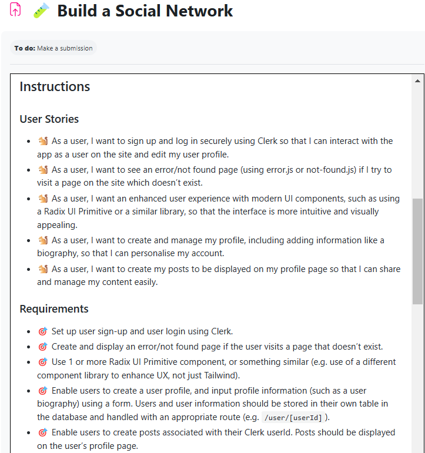
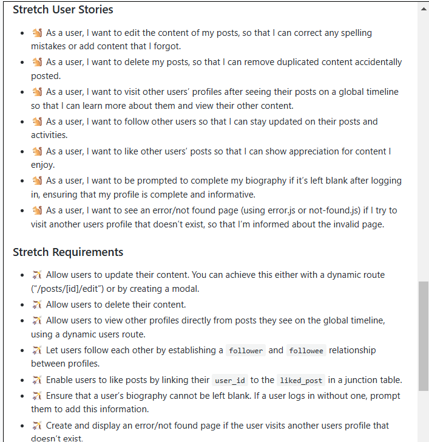

---

---

# ** Reflection**

---

_Required_

🎯 What requirements did you achieve?

🎯 Were there any requirements or goals that you were unable to achieve?

🎯 If so, what was it that you found difficult about these tasks?

---

_Optional_

🏹Requesting feedback about a specific part of your submission.

🏹What useful external sources helped you complete the assignment (e.g Youtube tutorials)?

    -https://youtu.be/t90U6iuv8wo?si=kuDPz41otUkt7Ig9

    -https://youtu.be/ICNulnfQvd8?si=44Zu63u5fkHS_YLT

    -https://www.sandromaglione.com/articles/supabase-database-user-sign-up-and-row-level-security

    -https://youtu.be/HvOvdD2nX1k?si=C0wPQFsOX-enifTk

🏹What errors or bugs did you encounter while completing your assignment? How did you solve them?

🏹What went really well and what could have gone better?

---
